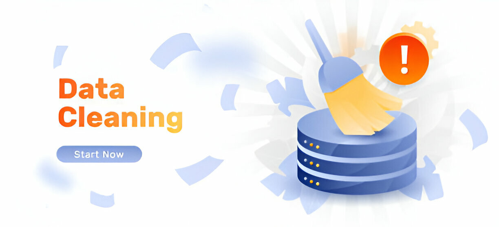

# Data-Cleaning-with-R

Data Cleaning can be said to be a process of identifying and correcting (or removing) errors, inconsistencies, and inaccuracies in data. with the goal of improving the quality of the data, making it more accurate, reliable, and suitable for analysis.Data Cleaning is very important in Data Analysis as a clean data would increase accuracy of any analysis or insights derived from it.Therefore a clean data enables Data Analysts to perform their tasks more effectively and deliver more valuable insights to their organizations.
The project contain a step by step process of how i cleaned the datasets which includes some of the following steps, checking for and removing of duplicate, checking for inaccuracies in date, Data standardization and many more 
i hope you would enjoy going through it 
Thanks for reading 

By Afahaene Gabriel Asuquo
